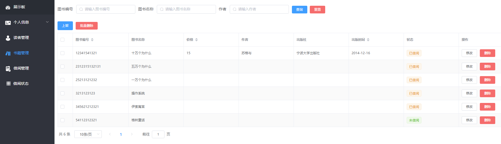
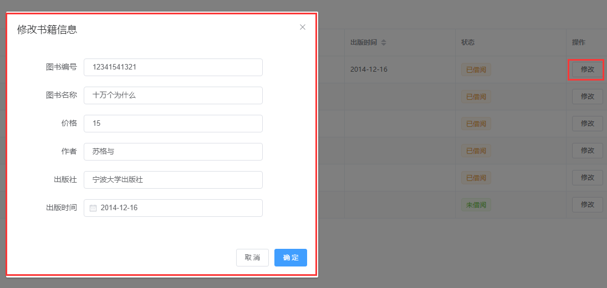
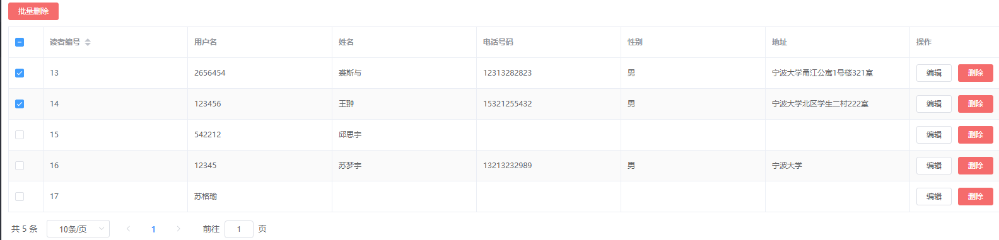
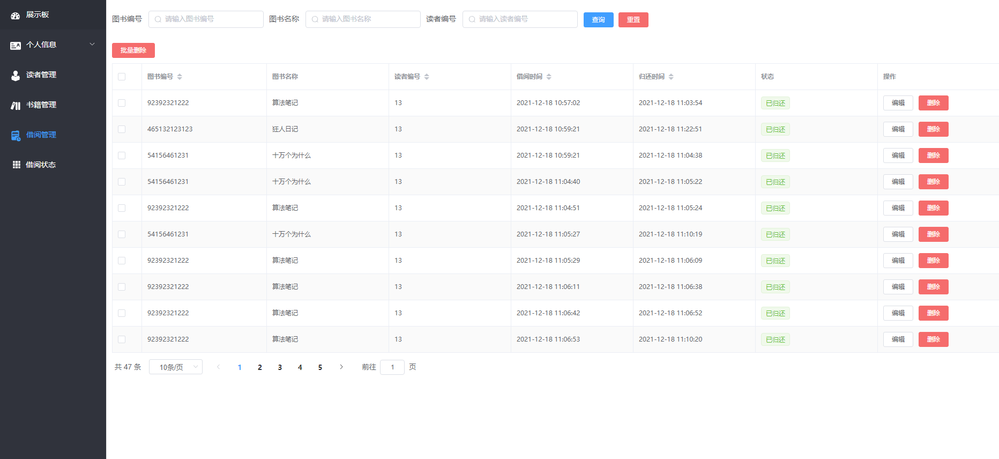
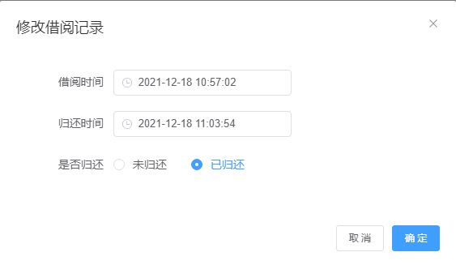
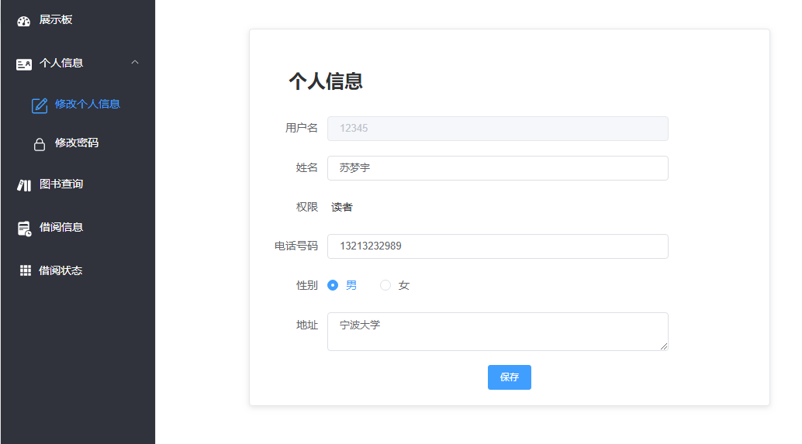
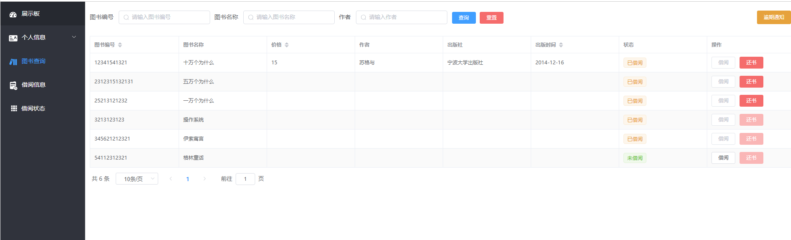
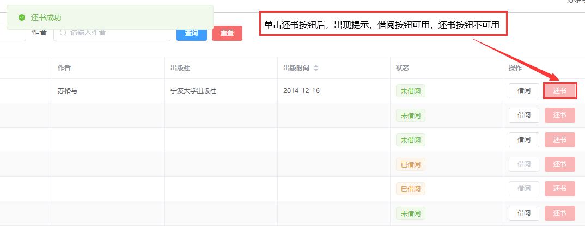
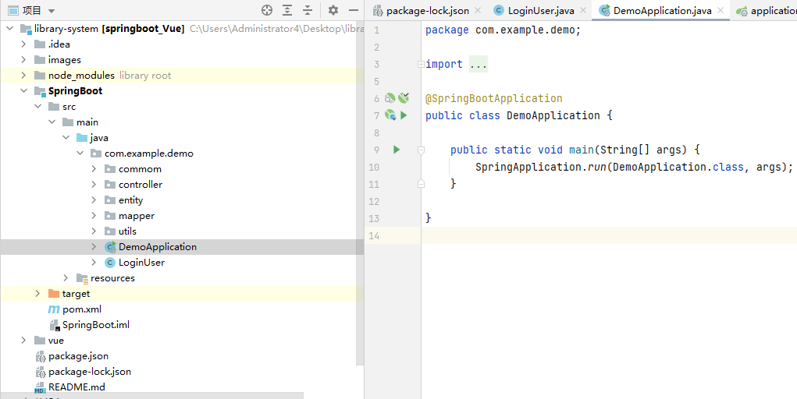
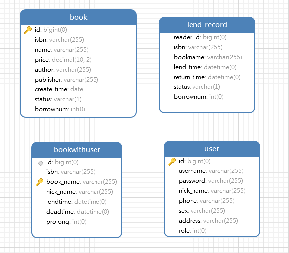

**完整代码收费 +   316595344     或    lz316595344  咨询**

**接毕业设计和论文**

**如果图片加载不出来可以去博客看 https://blog.csdn.net/qq_56450993/article/details/133581733**

**毕业设计所有选题地址**

**[github]👉https://github.com/XinChennn/allProjects**

**[gitee]👉https://gitee.com/xinchennn/allProjects**

**[忻辰的个人博客]👉https://www.ixinjiu.cn/articles/156**


# 图书馆管理系统（library-system）

## 本地快捷预览项目

第一步：运行 db 文件夹下的`springboot-vue.sql`(询问作者获取)，创建`springboot-vue`数据库

第二步：修改后端数据库配置文件，启动后端

第三步：vue目录下：在cmd运行npm install，npm run serve ，浏览器访问`localhost:9876`


## 主要技术

SpringBoot、Mybatis-Plus、MySQL、Vue3、ElementPlus等


## 主要功能

管理员模块：注册、登录、书籍管理、读者管理、借阅管理、借阅状态、修改个人信息、修改密码

读者模块：注册、登录、查询图书信息、借阅和归还图书、查看个人借阅记录、修改个人信息、修改密码


## 主要功能截图

### 登录

登录支持两种用户角色：管理员和读者

输入正确的账号、密码后，系统会自动识别管理员或者用户，并跳转到相应主页。


### 展示板页面


### 管理员界面

#### 图书管理

- 图书表格列表

   

- 添加图书

   

- 编辑图书

   

- 删除图书

   

   


#### 读者管理

- 读者管理的增删查改类似图书管理，不再赘述

  

  

#### 借阅管理

- 借阅记录查询

  

- 借阅记录编辑

  

  #### 借阅状态
  
  


### 读者界面

#### 读者信息

- 编辑个人信息

  

- 修改密码

  点击修改密码按钮，修改密码

  


#### 图书查询



#### 借阅图书


#### 归还图书



#### 借阅记录


#### 借阅状态


## 代码结构

### 前端

```shell
library-ui
├─api			// api接口
├─assets		// 资源文件	
│  ├─icon	 	// 图标
│  ├─img	 	// 图片
│  └─styles	 	// 样式
├─components	// 自定义Vue组件
├─layout		// 页面布局
├─router		// Vue路由
├─utils			// 工具函数
└─views			// 页面
```


### 后端

maven项目结构

```shell
library-serve
├─java
│  └─com
│      └─admin
│          └─library
│              ├─common			// 通用类
│              │  ├─base		// 基础类
│              │  └─config		// 配置类
│              ├─controller		// 控制层
│              ├─domain			// 实体类
│              ├─mapper			// 持久层
│              └─service		// 业务层
└─resources	// maven资源配置
```




## 数据库

**使用Navicat生成ER模型图**



**完整代码 +   316595344     或    lz316595344  咨询** 

**接毕业设计和论文**